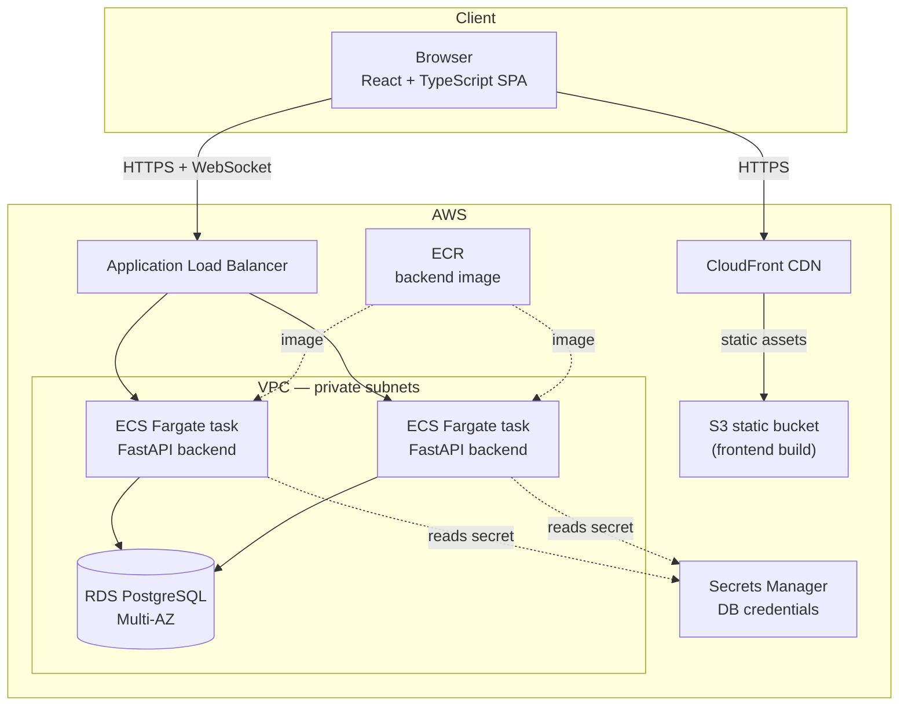

# Architecture

## Overview

PulseBoard is a three-tier application: a React single-page dashboard, a
FastAPI backend exposing a REST + WebSocket API, and a PostgreSQL database.
The backend is the only component that talks to the database; the frontend
never connects to it directly.

## Request flow

1. The browser loads the static React build from **CloudFront/S3**.
2. The SPA calls the API (`/api/...`) and opens a WebSocket
   (`/ws/dashboard`) against the **Application Load Balancer**, which
   forwards to one of the **ECS Fargate** backend tasks.
3. The backend reads/writes **RDS PostgreSQL** through SQLAlchemy and, on
   every mutation, broadcasts an event over the WebSocket connection manager
   (`app/services/realtime.py`) so every connected dashboard refreshes its
   data without the user reloading the page.
4. Database credentials are generated once by Terraform and stored in
   **Secrets Manager**; the ECS task definition injects them as an
   environment variable at container start, so no secret ever lives in the
   image or in source control.

## Tech-stack bill of materials

| Layer | Choice | Why |
|---|---|---|
| Frontend framework | React 18 + TypeScript + Vite | Fast dev server, small production bundles, wide ecosystem |
| Styling | Tailwind CSS | Utility-first, keeps the bundle small, easy to theme |
| Data fetching / cache | TanStack React Query | Handles caching, retries, and cache invalidation from WebSocket events cleanly |
| Charts | Recharts | Lightweight, composable, good enough for portfolio-level dashboards |
| Backend framework | FastAPI (Python 3.12) | Async-native, automatic OpenAPI docs, first-class WebSocket support |
| ORM / migrations | SQLAlchemy 2.0 + Alembic | Typed models, mature migration tooling |
| Database | PostgreSQL 16 | Relational integrity for a naturally relational domain (projects → tasks/budget/blockers); scales comfortably past thousands of projects |
| Auth | JWT (python-jose) + bcrypt (passlib) | Stateless auth, easy to scale horizontally across ECS tasks |
| Real-time | Native WebSocket (FastAPI) | No extra broker needed at this scale; see the note on Redis pub/sub below for multi-instance fan-out |
| Containerization | Docker (multi-stage builds) | Reproducible builds for both services |
| Cloud provider | AWS (ECS Fargate, RDS, S3, CloudFront, ALB) | Managed, autoscaling-friendly, no servers to patch |
| IaC | Terraform | Declarative, reviewable infrastructure changes |
| CI | GitHub Actions | Free for public repos, tight GitHub integration |

## Why relational over document-based

The domain here — projects that own tasks, budget entries, and blockers, all
owned by users who belong to teams — is a textbook case for foreign keys and
joins: a dashboard summary is fundamentally an aggregation query across
several one-to-many relationships. A document store (e.g. MongoDB) would
either duplicate owner/team data into every project document or require
application-side joins to reassemble the same view. PostgreSQL's native
`JSONB` column type remains available if a future feature (e.g. flexible
custom fields per project) needs a semi-structured escape hatch, without
giving up relational integrity for the core schema. See
[DATA_MODEL.md](DATA_MODEL.md) for the full schema and a discussion of how
this scales as more projects and teams are added.

## Scaling beyond the current design

- **More than a couple of backend replicas**: move the WebSocket
  `ConnectionManager` to a Redis pub/sub backend so a broadcast triggered on
  one task reaches clients connected to another. ElastiCache for Redis
  fits directly into the existing VPC.
- **Read-heavy executive dashboards at large scale**: add a read replica and
  point the `/api/dashboard/*` endpoints at it.
- **More than a few thousand projects**: the `stage`, `owner_id`, and
  `project_id` foreign key columns are already indexed (see the initial
  Alembic migration); revisit query plans with `EXPLAIN ANALYZE` before
  adding further indexes.
