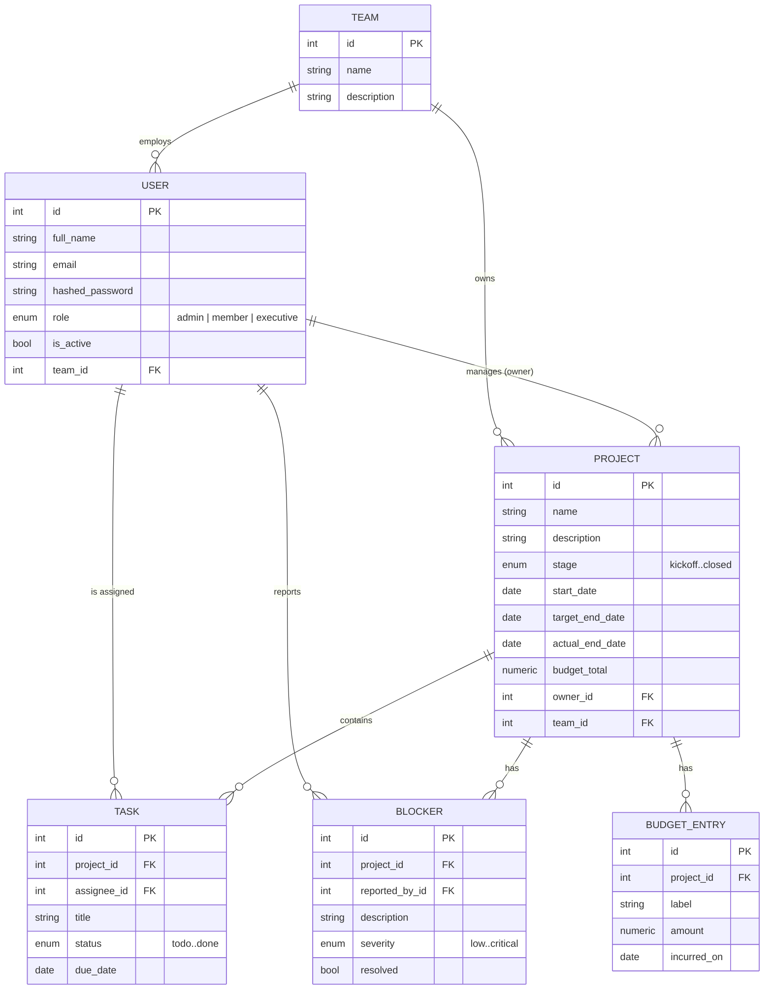

# Data Model

PulseBoard uses a normalized relational schema. Every table that scales with
the number of projects (tasks, blockers, budget entries) carries an indexed
foreign key back to `projects`, which is what keeps the dashboard's
aggregation queries fast as the portfolio grows.

## Entity-relationship diagram

## Table reference

### `teams`
A functional or cross-functional group. Projects and users optionally belong
to a team, which powers "filter by team" style views later without
requiring it up front.

### `users`
One row per authenticated account. `role` drives every permission check in
`app/core/permissions.py`. Passwords are stored as bcrypt hashes — never
plaintext, never reversible.

### `projects`
The central entity. `stage` tracks lifecycle (kickoff → planning →
in_progress → on_hold → review → closed). `budget_total` is the approved
budget; actual spend is the sum of `budget_entries` rows, computed on read
rather than duplicated as a column, so it can never drift out of sync.

### `tasks`
Individual units of work. A member may only edit a task where
`assignee_id` matches their own user id — enforced both by the UI
(`RoleGuard`) and, authoritatively, by the API (`can_write_task`).

### `blockers`
Reported obstacles with a `severity`. Only admins can mark one `resolved`,
which is what feeds the "timeline health" calculation described below.

### `budget_entries`
Append-only spend line items. Deleting a project cascades to delete its
entries (`ON DELETE CASCADE` via SQLAlchemy's `cascade="all, delete-orphan"`),
so there's no orphaned financial data left behind.

## Derived metrics (not stored, computed on read)

`app/services/analytics.py` computes, per project:

- **`budget_spent`** — sum of that project's `budget_entries.amount`
- **`budget_burn_pct`** — `budget_spent / budget_total * 100`
- **`open_blockers` / `critical_blockers`** — counts of unresolved blockers
- **`timeline_health`** — `on_track`, `at_risk`, or `delayed`, derived from
  the target date, budget burn, and open critical blockers (see the
  function's docstring for the exact rule order)

Keeping these as computed values rather than stored columns means they can
never drift out of sync with their inputs, at the cost of recomputing them
on every dashboard read — a reasonable trade-off below a few thousand
projects. If the portfolio grows large enough that this becomes a
bottleneck, the next step is a materialized view refreshed on a short
interval, not a rewrite of the model.

## Sample data

`backend/scripts/seed_data.py` generates 120 projects (comfortably above the
100-project acceptance threshold), each with a realistic spread of tasks,
budget entries, and — for about 30% of active projects — blockers, so every
dashboard widget has meaningful data immediately after a fresh install.

## Scaling as more projects and teams are added

- Every foreign key used in a `WHERE` clause (`projects.stage`,
  `tasks.project_id`, `blockers.project_id`, `budget_entries.project_id`) is
  indexed in the initial migration.
- The schema adds new teams or users without any migration — they're just
  new rows. Adding a genuinely new *kind* of tracked entity (e.g.
  "milestones") is a small, additive migration, not a redesign, because
  each entity already follows the same `project_id`-owned pattern.
- If multi-tenancy across separate companies is needed later (not just
  teams within one company), the cleanest path is a `tenant_id` column on
  `projects` and `users` plus a Postgres row-level security policy — not a
  restructuring of the tables described here.
